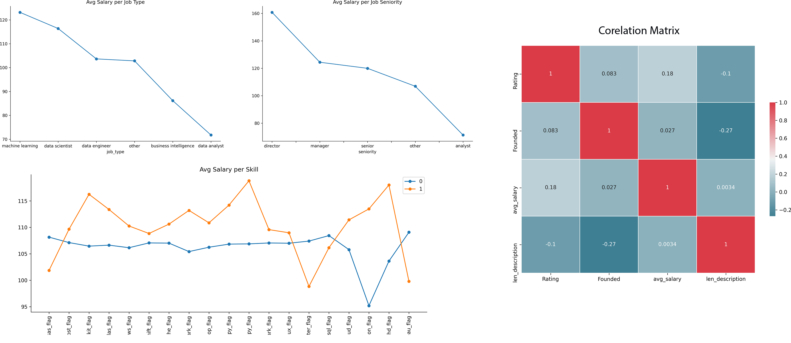

# Project - Data Scientist Salarys in USA

## Description
The process of getting a job is pretty hard, starting from the interviews and going all the way to the salary negotiation.

This project aims to help Data Scientists in this last step, giving them an estimate salary based on some infos about the job/company.

## Overview
* Scrapped almost 1700 jobs data from glassdoor using python.
* Explored the data trying to find some non-obvious correlations 
    * Engineered features from job description to quantify dependency of some requirements (python, sql, aws, spark, hadoop, phd, etc).
* Created a model with a 16.3K mean absolute error on predicting a job salary (yearly).

## Project Timeline

### Web Scrapping

Did some modification on an pre-existing scrapper code (credits below) to scrap about 1700 jobs postings from Glassdoor. 

Those were keeped in two parts, with ~850 jobs each. That's beacause the site has a maximum of 30 pgs per research and each time a different job may appear. With each job we tried to get the following:

* Job Title
* Salary Estimate
* Job Description
* Rating
* Company Name
* Location
* Headquarters (no data found, may be due to my location)
* Size
* Founded
* Type of ownership
* Industry
* Sector
* Revenue
* Competitors (no data found, may be due to my location)

### Data Cleaning

After the data collection, I needed to do the first cleaning of the data to make it more friendly for the next step.

* Dropped duplicated rows
* Removed the "Competitors" and "Headquarters" columns
* Removed rows without salary
* Parsed numeric data out of salary, and converted horly value to yearly
* Removed rating out of companys name text

### Exploratory Data Analysis

In this part I've started trying to extract the most important information from "Job Title" and "Job Description" fields.
* *Job Title:* Groupped into two different attributes (Job Type and Seniority)
* *Job Description:* New columns for every important skill I've mapped (binary 0 or 1)

### Model Building

Selected only the variables that were related to the target variable (salary) and transformed the categorical variables into dummy variables. 

As it is a regression problem, Median Absolube Error(MAE) was used as a metric to calcullate the model effectiveness. 

That beein said, four models were tested and it`s results are shown belown
* **Linear Regression:** 18,230,897,648.24 (I dont really know why I am getting such a huge error)
* **K Neighbor:**  20.04
* **Decision Tree:** 20.28
* **Random Forest:** 16.33

After finding the best model, I have tried to tune its hyperparameters throught Random Search method.
The results didn't change and MAE stills at 16.33

## Credits
The glassdoor scrapper main code idea was taken from [this](https://github.com/arapfaik/scraping-glassdoor-selenium) GitHub repo.
* Some minor changes were made to fix some bugs
